#  UML and Class Diagrams

### Learning Objectives

*After this lesson, students will be able to:*

* Explain how UML and class diagrams are used by developers.
* Identify which connectors to use in a class diagram.
* Write code based on a class diagram.

### Lesson Guide

| TIMING  | TYPE  | TOPIC  |
|:-:|---|---|
| 5 min  | Opening  | Lesson Objectives |
| 10 min | Instruction | UML |
| 30 min | Instruction | Class Diagrams |
| 35 min | Student Activity | Coding a Trading System | 
| 5 min  | Conclusion | Review/Recap |

## Introduction (5 min)

By now, you've seen many examples of pretty arcane code that make even simple programs hard to follow.

Wouldn't it be great if we could express programs clearly, without having to plow through all of the terse language syntax?

That's where UML comes in.

In this lesson, we'll discuss class diagrams. There's another popular type of UML, known as sequence diagrams, but we won't have time to get to it in class. 

---

## What Is UML? (10 min)

**Unified Modeling Language** (UML) is a graphic-based language that uses intuitive pictures to express program structure and interactions.

There are several categories of UML diagrams, including:

* **Class diagrams**: These represent the static structure of classes and their dependencies.
* **Package diagrams**: These represent the relationships between packages.
* **Sequence diagrams**: These represent the dynamic interactions between objects.
* **Use case diagrams**: These represent the high-level dynamic capabilities of a system. 

### Using UML

Using UML, a software architect or program designer can quickly describe the structure and interactions of a system in a model. They can use those models to communicate implementation details to developers and engineers, much as a building architect can use blueprints to communicate the details of a building to the engineering staff. 

There are many tools on the market for preparing UML diagrams. There are specialized enterprise-quality tools such as Enterprise Architect and IBM Rational, and free tools such as ArgoUML, as well as general modeling tools such as LucidChart and Microsoft Visio. Many tools provide capabilities to reverse-engineer code as well as generate code from models. Usually, the choice of tool will be dictated by your shop.

> **Knowledge Check**: Play it back to me — what is the purpose of UML? 

--- 

## Class Diagrams (30 min)

Let's walk through an example of a UML **class diagram**.

Imagine that you are building a trading system for financial assets such as stocks, bonds, and commodities.

A trader will have a brokerage account, and they will log in, place a buy, sell, order a number of assets, and then log out. 

The broker must check if they have available credit or require a cash payment. They'll place the trade to the market and capture the details on their internal database.

You'll notice that, in our description of this system, we used real-life words such as asset, stock, bond, commodity, trader, broker, market, credit, payment, and database.

These can all be modeled in a UML class diagram.

Put briefly, a UML class or interface is represented as a rectangular box with three horizontal sections:

* The top section holds the class name.
* The middle section contains the field names. 
* The bottom section holds the method names.

Abstract classes and interfaces are represented by italicizing the class name. 

For example, let's model our `Asset` class, which is the base class for all assets:  

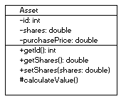

From the diagram, we can see that the class name is `Asset` and there are three fields: `id`, `shares`, and `purchasePrice`. There are four methods: `getId()`, `getShares()`, `setShares()`, and `calculateValue()`.

Notice that we prefixed the fields and methods with `-`, `+`, and `#`. These are examples of _visibility_ indicators. The full list of visibility is as follows:

|Symbol|Meaning|
|:---:|---|
|+|public|
|-|private|
|#|protected|
|~|package (_default_, in Java)|

To specify the type of field or the return type of a method, the field or method name is followed by a colon and then the return type. 

You can see how these diagrams contain sufficient information to generate the class structure. The programmer's job would be to fill in the implementation details and documentation. 

### Connectors

A UML class diagram arranges these classes on a blank canvas and then uses connector lines and arrows to represent the class inter-relationships.

The shapes of the lines and arrows indicate the kind of relationships as follows:

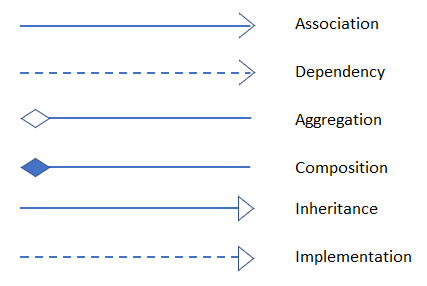

Basically, the connectors indicate the kind of relationship. Some of the differences are subtle, so let's discuss each of them.

#### Association

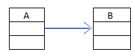  

An **association** connector depicts that Class A _has a field_ of Type B.

#### Dependency

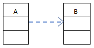

A **dependency** connector depicts that Class A might not have a field of Type B, but that it uses Type B as an import; for example, as a local type in a method.

#### Aggregation

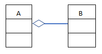  

**Aggregation** and **composition** are subsets of association. In fact, the generated code would be identical. Whereas association indicates that Class A has a field of Type B, aggregation indicates that Class A has a field of Type B, but B can exist independently of A. 

#### Composition

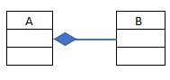

While aggregation indicates that A refers to B but B can exist without A, composition indicates that B is a vital part of A.

A building has rooms and a superintendent. If you take away the superintendent, you still have a building (for a while!). That is aggregation. But, if you take away the rooms, the building ceases to exist. That is composition, and both are associations.

> Note the direction of the arrows. In association, the arrow head is on the dependent class, whereas with aggregation and composition, the rhombus is on the containing class.

#### Inheritance

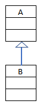  

**Inheritance** connectors indicate the subclasses of a class (i.e., the classes that extend a class). In this example, Class B extends Class A. Generally, the subclass is drawn below the base class, and the inheritance arrow is drawn pointing upward. That is consistent with the naming convention we saw earlier, where "upcasting" is the operation of casting a subclass to its base class, and "downcasting" is the operation of casting a class to a subclass. Up and down refer to the direction of the inheritance arrow.

To indicate several subclasses, we generally merge the arrows as follows:  

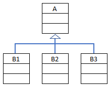  

In this diagram, Classes B1, B2, and B3 all extend Class A.

#### Implementation

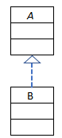  

**Implementation** is similar to inheritance, except Class A is an interface, and the arrow indicates that Class B implements Interface A.

#### Multiplicity

You can also include **multiplicity** indicators on the connecting arrows; some number greater than or equal to zero, or a `*`.

In the following, we see that a cat has up to four legs, and a leg belongs to (at most) one cat.  

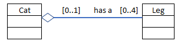  

### Whew, Let's Recap All That! 

The amount of detail included in a UML diagram depends on the level of granularity you are trying to convey. If you just want to convey the high-level class relationships, you can omit some or all of the fields and methods.

Even if you are not generating code from your UML, you can see the benefit of using UML over code for communicating code structure.

---

## Student Activity (35 min)

Let's get started coding our trading system from existing models. Here's the class diagram for a trading system:

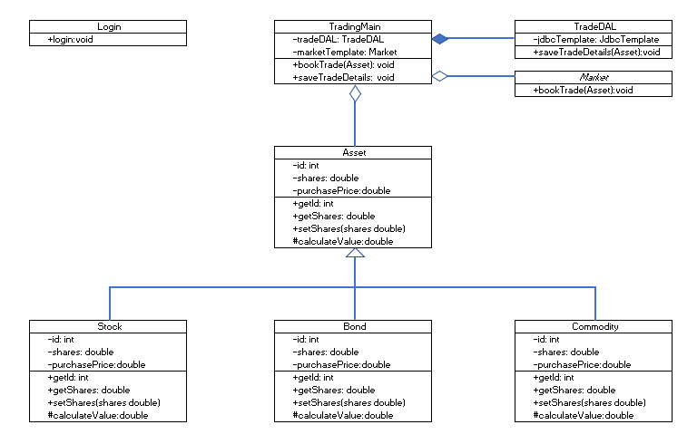  

Your task is to generate the Java classes represented in this diagram.

Note that `Market` is an interface, as indicated by the italics. All of the others are concrete (non-abstract) classes.

--- 

## Conclusion (5 min)

Check out the `src` directory to see how you did with your code. 

- How did it go?
- Was it easy or difficult to write code from the diagram?
- Did you notice anything about the system that you wouldn't have normally?
